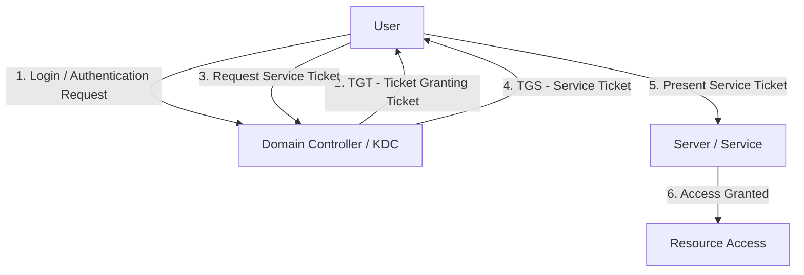

<h1 align="center"> Intro to AD Authentication </h1>


---


### Lab RooM:


---


### Table of Contents


----


### Active Directory Diagram 


---


## Task 1: Introduction 


### AD Authentication
When we access an **Active Directory (AD)** environment, the first thing we need to understand is **authentication**.

#### What is Authentication?

**Authentication** means proving who you are.

For example:
````mermaid
flowchart TD
    A[User] -->|Credentials| B[Domain Controller]
    B -->|Verify| C{Valid?}
    C -->|Yes| D[Access Granted]
    C -->|No| E[Access Denied]
````

**AD** mainly uses two authentication protocols:
| Protocol     | Main Purpose                 | Important Idea     |
| ------------ | ---------------------------- | ------------------ |
| **NTLM**     | Older Windows authentication | Challenge-response |
| **Kerberos** | Modern AD authentication     | Tickets            |


#### NTLM

NTLM is an older authentication protocol.

It uses a **challenge-response** process:

````mermaid
flowchart TD
    A[Client] -->|1. I want to authenticate| B[Server]
    B -->|2. Challenge| A
    A -->|3. Response based on password/hash| B
    B -->|4. Verify| C{Valid?}
    C -->|Yes| D[Access Granted]
    C -->|No| E[Access Denied]
````

The password itself is **not sent directly** across the network.


**NTLM** is still found in Windows environments, especially for:
- Legacy applications
- Systems that cannot use Kerberos
- Certain fallback authentication situations


#### Kerberos

**Kerberos** is the primary authentication protocol used by modern Windows domains.

Instead of repeatedly sending credentials, Kerberos uses tickets:



| Term    | Meaning                                                     |
| ------- | ----------------------------------------------------------- |
| **KDC** | Kerberos authentication service, normally running on the DC |
| **TGT** | Ticket Granting Ticket                                      |
| **TGS** | Ticket for accessing a specific service                     |
| **SPN** | Identifies a service in the domain                          |


> Windows **New Technology LAN Manager (NTLM)** is a suite of security protocols offered by Microsoft to authenticate users’ identity and protect the integrity and confidentiality of their activity.


> **Kerberos** is a computer network authentication protocol that operates based on tickets, allowing nodes to securely prove their identity to one another over a non-secure network.
> 
> It primarily aims at a client-server model and provides mutual authentication, where the user and the server verify each other's identity.
> 
> The Kerberos protocol messages are protected against eavesdropping and replay attacks, and it builds on symmetric-key cryptography, requiring a trusted third party.


---


### Learning Objectives

In this room, you will learn:
- What authentication means in an Active Directory environment
- The difference between authentication and authorisation
- How NTLM and Kerberos authentication work at a high level
- How to identify which authentication protocol was used during login
- Common weaknesses in AD authentication that attackers can exploit


---


### Starting the Network

Click **Start**:


#### Active Directory Lab Network

| Device         | Hostname         | IP Address       | Role                   |
| -------------- | ---------------- | ---------------- | ---------------------- |
| Windows Server | `ROOTDC.THM.LOC` | `192.168.11.100` | Domain Controller (DC) |
| Windows Server | `SERVER1`        | `192.168.11.51`  | Domain-Joined Server   |


---


### Question & Answer:


-----


## Task 2: Authentication in AD

Authentication in **Active Directory (AD)** is the process of proving who you are before you can access domain resources.

````mermaid
flowchart TD
    User["User<br/>I am John<br/>Credentials"]
    AD["Active Directory<br/>Verify identity"]
    Auth["Authentication"]

    User --> AD
    AD --> Auth
    Auth -->|Valid| Access["Login / Access"]
    Auth -->|Invalid| Denied["Denied"]
````


### Authentication Material

Authentication material is information used to prove your identity.

Sample:
| Authentication Material | Example              | Meaning                                           |
| ----------------------- | -------------------- | ------------------------------------------------- |
| Username + Password     | `john / Password123` | Something we know                                |
| Certificate             | Digital certificate  | Proves identity cryptographically                 |
| Hash                    | Password hash        | Can sometimes be abused in authentication attacks |


#### Username and Password

The most common method: ``Username + Password`` -> ``Domain Controller`` -> ``Verify Credentials``.


#### Certificates

A certificate can prove the identity of a user or computer.

Commonly used for:
- Smart cards
- Machine authentication
- Certificate-based authentication


#### Password Hashes

A password is normally stored as a **hash**, not plaintext.

In some attack scenarios, an attacker may be able to use a password hash to authenticate without knowing the original password.

> Authentication material = information used to prove who we are.


---


### Authentication vs Authorisation

These two concepts are very important:

| Concept            | Question             | Example                    |
| ------------------ | -------------------- | -------------------------- |
| **Authentication** | Who are you?         | "You are John."            |
| **Authorization**  | What can you access? | "John can access Finance." |


````mermaid
flowchart TD
    User["User"]
    Auth["Authentication<br/>Who are you?"]
    Identity["Identity"]
    Authz["Authorization<br/>What can you do?"]
    Granted["Access Granted"]
    Denied["Access Denied"]

    User --> Auth
    Auth --> Identity
    Identity --> Authz
    Authz --> Granted
    Authz --> Denied
````


Example

John logs into the company domain.

````mermaid
flowchart TD
    subgraph Authentication
        A1["John"]
        A2["Domain Controller"]
        A3["You are John."]
        A1 -->|Username + Password| A2
        A2 --> A3
    end

    subgraph Authorization
        B1["John"]
        B2["Check Groups / Permissions"]
        B3["Finance Group → Finance Share"]
        B4["HR Group → HR Share"]
        B5["No Permission → Access Denied"]
        B1 --> B2
        B2 --> B3
        B2 --> B4
        B2 --> B5
    end

    A3 --> B1
````

---


### AD Authentication Protocols

Active Directory mainly uses two important authentication protocols:
| Protocol           | Type               | Main Idea                                     |
| ------------------ | ------------------ | --------------------------------------------- |
| **NetNTLM / NTLM** | Challenge-response | Prove identity using a challenge and response |
| **Kerberos**       | Ticket-based       | Use tickets to authenticate                   |


````mermaid
flowchart TD
    AD["AD Authentication"]
    NTLM["NTLM"]
    Kerberos["Kerberos"]
    CR["Challenge / Response"]
    Tickets["Tickets"]

    AD --> NTLM
    AD --> Kerberos
    NTLM --> CR
    Kerberos --> Tickets
````


